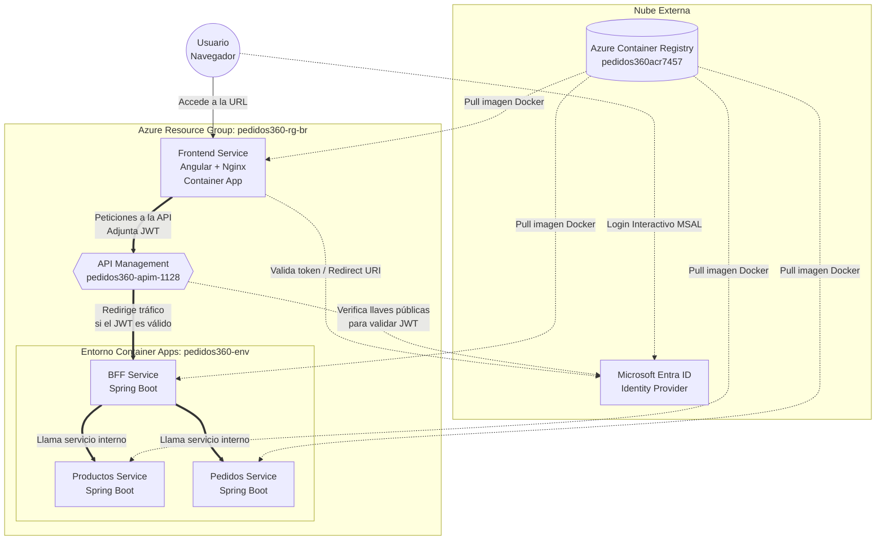
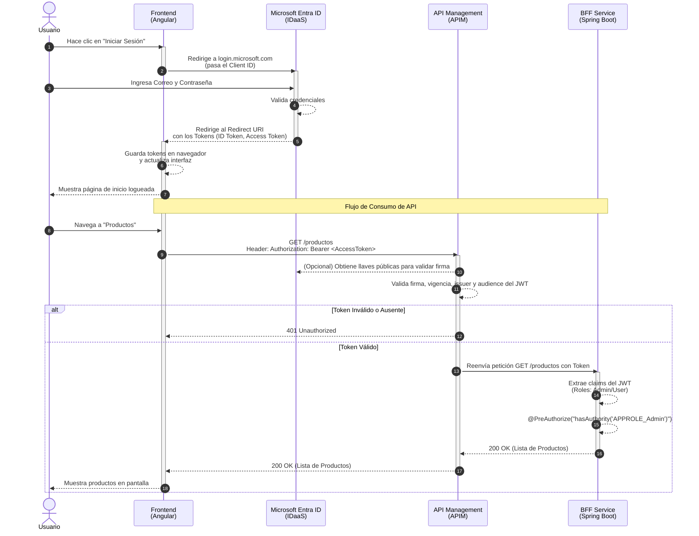

# CloudNative — Pedidos360

Arquitectura base del sistema **Pedidos360**: frontend en Angular con autenticación en Azure AD (MSAL), backend en microservicios Spring Boot, y un BFF que valida cada token de forma independiente antes de dejarlo pasar. 

Todo el ecosistema está desplegado en un entorno nativo de nube en Azure.

---

## 1. Estructura del Repositorio

```text
CloudNative/
├── backend/         # Microservicios Spring Boot
│   ├── bff-service/       # Valida JWT de Azure AD y autoriza por rol (BFF)
│   ├── pedidos-service/    # Gestion de pedidos
│   └── productos-service/  # Catalogo de productos
├── frontend/         # App Angular 18 + MSAL
├── docs/             # Documentación, setup de Azure AD y guías de despliegue
│   ├── architecture.md
│   ├── azure-setup-guide.md
│   └── deployment-guide.md
├── README.md                 # Este archivo
├── Flujo_Autenticacion.puml  # Diagrama de secuencia del login (PlantUML)
└── Arquitectura_Despliegue.puml # Diagrama visual de infraestructura en Azure (PlantUML)
```

---

## 2. Conceptos Clave

### ¿Qué es MSAL y qué hace?
**MSAL (Microsoft Authentication Library)** es una librería oficial de Microsoft que le permite a nuestra aplicación web (el frontend en Angular) iniciar sesión con cuentas de Microsoft de manera segura. 
- **¿Qué hace?** Se encarga de todo el trabajo sucio: abrir la ventana emergente de inicio de sesión de Microsoft, guardar tu sesión en el navegador, renovar tu sesión cuando expira, y adjuntar un "token de acceso" (una llave digital) a cada petición que el frontend le hace al backend.

### ¿Qué es un Token JWT y qué se evalúa?
Un **JWT (JSON Web Token)** es como una credencial o carnet de identidad digital que Microsoft nos da cuando iniciamos sesión correctamente. 
- **¿Qué se evalúa?** Cuando el Frontend le manda este token al Backend, el Backend (API Management y BFF) no confía a ciegas. Evalúa cuatro cosas críticas:
  1. **Firma:** ¿Fue realmente firmado por Microsoft? (Evita falsificaciones).
  2. **Vigencia (Expiration):** ¿El token sigue siendo válido o ya expiró por tiempo?
  3. **Audiencia (Audience):** ¿Este token fue emitido específicamente para nuestra aplicación o nos están enviando el token de otra app distinta?
  4. **Roles:** ¿Qué permisos tiene el usuario? (Ej: "Admin" o "User").

### ¿Qué es un Redirect URI?
Cuando le decimos a Microsoft "Oye, autentica a este usuario por favor", Microsoft necesita saber **hacia dónde devolver al usuario** una vez que ponga su contraseña con éxito (o devuelva un error). El **Redirect URI** es esa dirección de retorno.
Si la dirección a la que Microsoft debe devolverlo no está explícitamente anotada en su base de datos (en Azure Portal), Microsoft aborta el login por seguridad para evitar que roben la sesión desde otra página falsa (Error `AADSTS50011`).

### ¿La aplicación corre desde mi PC o desde Azure?
**¡Se ejecuta 100% en Azure!** 
Escribimos el código en local, pero actualmente no estamos corriendo `ng serve` ni `mvn spring-boot:run` para consumirlo. Lo que hicimos fue:
1. Tomar el código fuente y **empaquetarlo** en una imagen de Docker (una caja que contiene el código + su propio sistema operativo + servidor web).
2. Subir esa "caja" (la imagen) a **Azure Container Registry (ACR)**, que es un almacenamiento de imágenes en la nube.
3. Pedirle a **Azure Container Apps** que tome esa imagen de la nube, la encienda en sus servidores físicos (contenedores) y la mantenga viva 24/7.
4. Por lo tanto, tu PC puede estar apagado y el mundo entero puede seguir accediendo a la URL pública y usar el sistema.

---

## 3. Arquitectura de Despliegue

Actualmente, el sistema está compuesto de varios recursos en Azure conectados entre sí. El siguiente diagrama muestra la infraestructura y cómo interactúan:



En resumen:

- **Frontend (Container App):** Nuestra aplicación Angular está empaquetada dentro de un servidor Nginx en un contenedor en la nube. Es la cara visible que carga el navegador.
- **Entra ID (Azure AD):** Es nuestro servidor de identidad. Se encarga de validar correos y contraseñas.
- **API Management (APIM):** Es el guardia de seguridad del backend. Intercepta todas las llamadas del Frontend, revisa que traigan un Token válido y solo si es válido, las deja pasar al BFF.
- **Backend For Frontend (BFF):** Es el primer microservicio de Java. Lee el token para saber quién eres y luego orquesta los llamados hacia los demás microservicios internos.
- **Microservicios (Productos y Pedidos):** Son los servicios internos que hacen el trabajo pesado. No son accesibles desde internet directamente, solo el BFF puede hablarles.

---

## 4. Flujo de Autenticación E2E (End-to-End)

El proceso completo paso a paso es el siguiente:



1. **Intento de Acceso:** El usuario entra a la URL del frontend y hace clic en "Iniciar Sesión".
2. **Redirección MSAL:** MSAL redirige al usuario hacia los servidores de Microsoft (`login.microsoftonline.com`).
3. **Login Microsoft:** El usuario pone su correo y clave.
4. **Respuesta hacia Redirect URI:** Microsoft valida la clave y devuelve al usuario hacia nuestra URL (Redirect URI) adjuntando los Tokens.
5. **MSAL Interceptor:** El usuario navega en la app, y cuando el frontend necesita pedirle la lista de productos al Backend, el interceptor de MSAL "atrapa" la petición y le pega el Token de Acceso en las cabeceras.
6. **Validación en APIM:** El APIM recibe la petición, lee el token, verifica su firma con Microsoft. Si es válido, lo deja pasar.
7. **Validación en BFF:** El BFF recibe la petición, extrae los Roles del usuario desde el token y verifica que tenga permisos de acceso.
8. **Respuesta Exitosa:** El Backend devuelve los datos y el Frontend los muestra en pantalla.
